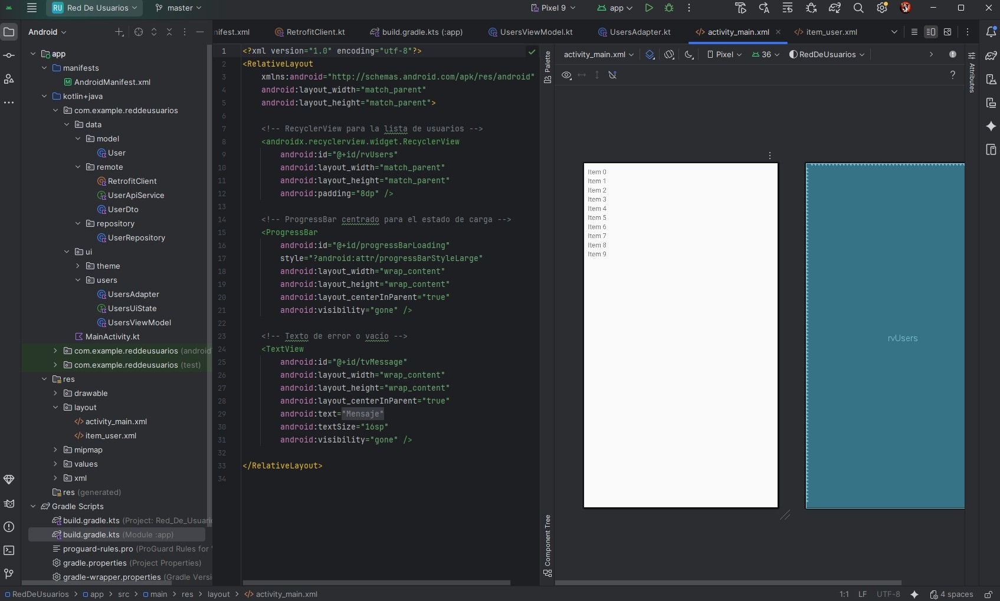

**_<h1 align="center">:vulcan_salute: Proyecto Realizado con Andoid Studio :computer:</h1>_**

**<h3>:blue_book: Contexto:</h3>**

<p>Imagina que trabajas en un equipo de desarrollo de una aplicación para una empresa que gestiona una red de usuarios. Tu tarea consiste en construir una parte de la aplicación que permita obtener la lista de usuarios desde un servicio REST y mostrarla en una interfaz de usuario limpia y eficiente.</p>

**<h3>:orange_book: Requerimiento:</h3>**

<p>Tu aplicación debe ser capaz de consumir un servicio REST que devuelve una lista de usuarios en formato JSON, y mostrar esa lista en un RecyclerView. Cada usuario tiene un nombre, un correo electrónico y un ID. La interfaz de usuario debe actualizarse dinámicamente cuando los datos sean recibidos.</p>

**<h3>:green_book: Requerimientos Específicos:</h3>**

1. Consumir un servicio REST utilizando Retrofit en Kotlin.
2. Actualizar la interfaz de usuario en tiempo real utilizando LiveData y ViewModel.
3. Mostrar los datos obtenidos en un RecyclerView, utilizando un adaptador.
4. Manejo de errores como desconexión de red o errores en el servicio REST.
5. La interfaz debe ser intuitiva y visualmente atractiva, mostrando el nombre y correo electrónico de cada usuario.
6. Implementar la lógica de negocio y la capa de presentación de manera desacoplada, aplicando buenas prácticas de arquitectura.

**<h3>📁 Estructura del Proyecto Android:</h3>**

```Android
📘 README.md
📁 app/src/main/
├── 🟧 AndroidManifest.xml
├── 📁 java
│   ├── 📁 com.example.reddeusuarios
│   │   ├── 📁 data
│   │   │   ├──📁 model
│   │   │   │   └── 🟦 User.kt
│   │   │   ├── 📁 remote
│   │   │   │    ├── 🟦 RetrofitClient.kt
│   │   │   │    ├── 🟦 UserApiService.kt
│   │   │   │    └── 🟦 UserDto.kt
│   │   │   └── 📁 repository
│   │   │        └── 🟦 UserRepository.kt
│   │   ├── 📁 ui
│   │   │   ├── 📁 theme
│   │   │   │    ├── 🟦 Color.kt
│   │   │   │    ├── 🟦 Theme.kt
│   │   │   │    └── 🟦 Type.kt
│   │   │   └── 📁 users
│   │   │        ├── 🟦 UsersAdapter.kt
│   │   │        ├── 🟦 UsersUiState.kt
│   │   │        └── 🟦 UserViewModel.kt
│   │   └── 🟦 MainActivity.kt
│   ├── 📁 com.example.reddeusuarios (android Test)
│   │   └── 🟦 ExampleInstrumentedTest.java
│   └── 📁 com.example.reddeusuarios (test)
│       └── 🟦 ExampleUnitTest.java
├── 📁 java (generated)
├── 📁 res
│   ├── 📁 drawable
│   │   ├── 🖼️ app_red_usuarios_1.jpg
│   │   ├── 🖼️ app_red_usuarios_2.jpg
│   │   ├── 🟧 ic_launcher_background.xml
│   │   └── 🟧 ic_launcher_foreground.xml
│   ├── 📁 layout
│   │   ├── 🟧 activity_main.xml
│   │   └── 🟧 item_user.xml
│   ├── 📁 mipmap
│   ├── 📁 values
│   │   ├── 🟧 themes
│   │   ├── 🟧 colors.xml
│   │   └── 🟧 strings.xml
│   └── 📁 xml
📁 Gradle Scripts
├── 🟦 build.gradle.kts (Project: RedDeUsuarios)
├── 🟦 build.gradle.kts (Module: app)
├── 🟦 proguard-rules.pro (ProGuard rules for ":app")
├── 🟦 gradle.properties (Project properties)
├── 🟦 gradle-wrapper.properties (Gradle Version)
├── 🟦 libs.versions.toml (version Catalog "libs")
├── 🟦 local.properties (SDK Location)
└── 🟦 settings.gradle.kts (Project Settings)
```

**<h3>:blue_book: Desarrollo del módulo Red de Usuarios:</h3>**

<p>En este proyecto implemente un flujo completo de consumo de datos REST en Android desde un JSON alojado en GitHub Raw ( <code>usuarios.json</code> con lista 10 usuarios)</p>
<p>La app sigue el patrón MVVM para mantener separadas la capa de datos y la capa de presentación.</p>
<p>Usé Retrofit + Gson para convertir la respuesta a una lista de objetos Kotlin, con ViewModel controle el ciclo de carga de la lista y la visualización de la pantalla principañ con un RecyclerView.</p>

**<h3>:book: Imagen general del proyecto:</h3>**

<table>
  <tr>
    <td align="center">
      <strong>Proyecto Vista General</strong><br>
      
    </td>
  </tr>
  <tr>
    <td align="center">
      <strong>Proyecto Vista General</strong><br>
      
    </td>
  </tr>
</table>